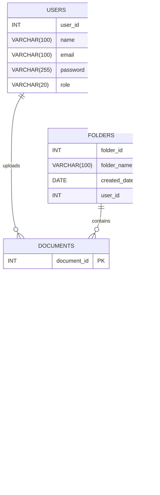

```mermaid
erDiagram

    USERS {
        INT user_id PK
        VARCHAR(100) name
        VARCHAR(100) email
        VARCHAR(255) password
        VARCHAR(20) role
    }

    FOLDERS {
        INT folder_id PK
        VARCHAR(100) folder_name
        DATE created_date
        INT user_id FK
    }

    DOCUMENTS {
        INT document_id PK
        VARCHAR(150) title
        VARCHAR(100) category
        VARCHAR(20) file_type
        DATE upload_date
        VARCHAR(30) status
        INT folder_id FK
        INT user_id FK
    }

    DOCUMENT_VERSIONS {
        INT version_id PK
        VARCHAR(20) version_no
        DATE modified_date
        INT document_id FK
    }

    USERS ||--o{ FOLDERS : creates
    USERS ||--o{ DOCUMENTS : uploads
    FOLDERS ||--o{ DOCUMENTS : contains
    DOCUMENTS ||--o{ DOCUMENT_VERSIONS : has
```